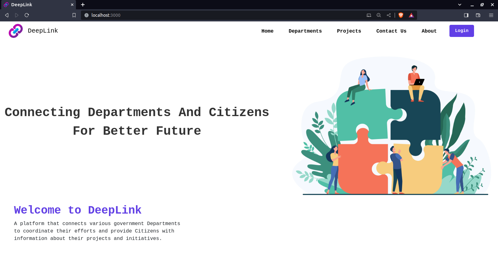

# Deeplink Project


## Overview

Deeplink is a collaborative platform built using Python Flask, SQLite3, and React JS. It aims to facilitate collaboration among various government departments, enabling them to track and manage their projects efficiently. Additionally, it provides citizens with the ability to view project details and monitor the progress of initiatives undertaken by the government.

## Features

- **Department Collaboration:** Allows different government departments to collaborate on projects.
- **Project Tracking:** Enables tracking of project progress and basic details.
- **Citizen Access:** Provides citizens with a transparent view of government projects.

## Technologies Used

- Python Flask
- SQLite3
- React JS

## Getting Started

### Prerequisites

Make sure you have the following installed:

- Python
- Node.js and npm

### Installation

1. Clone the repository:

   ```bash
   git clone https://github.com/your-username/deeplink.git
   cd deeplink

## Install Backend Dependencies:

pip install -r requirements.txt

## Running the Application:

1. Start the Backend:
python app.py

2. Start the Frontend (in the frontend directory):
npm start

3. Access the application at http://localhost:3000.

## Usage

### Department Users:

- Log in with your credentials.
- Collaborate on projects and track their progress.

### Citizens:

- Visit the public interface to view government projects.
- Access project details and monitor progress.

## Contributing

Contributions are welcome! Please follow these guidelines:

1. Fork the repository.
2. Create a new branch: `git checkout -b feature-name`.
3. Make your changes and commit them: `git commit -m 'Add new feature'`.
4. Push to the branch: `git push origin feature-name`.
5. Submit a pull request.

## License

This project is licensed under the MIT License.

## Acknowledgments

Thanks to contributors who have contributed to this project.
